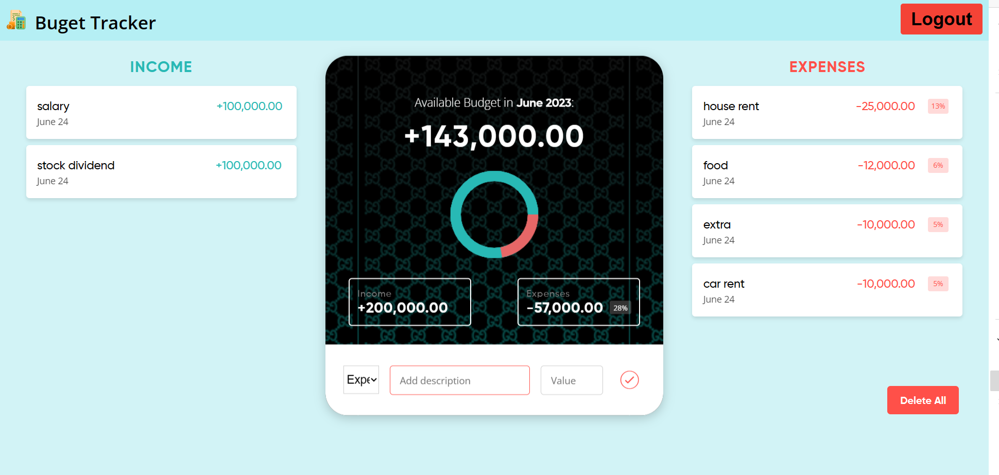
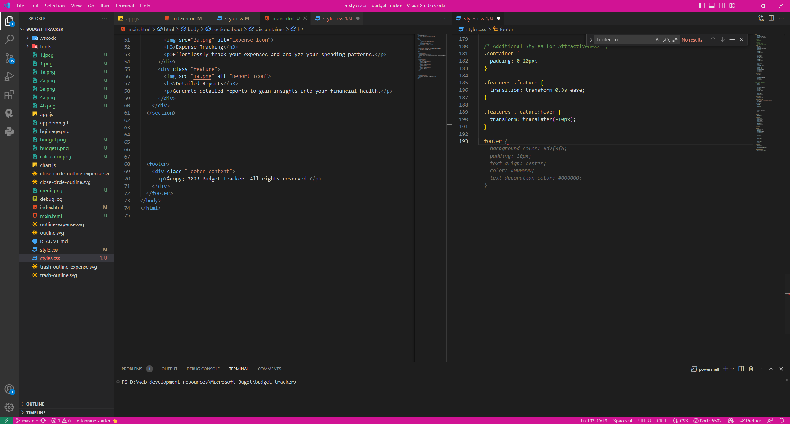
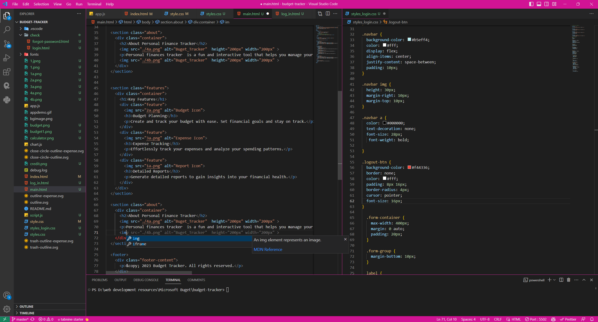

# Budget Tracker

#### Personal Finance Manager: A comprehensive and user-friendly tool to track, manage, and optimize your finances. Effortlessly monitor income, expenses, budgets, and savings goals. Gain insights through intuitive visualizations and generate financial reports. Achieve financial freedom and make informed decisions with this powerful personal finance management solution.

## Table of Contents

- [Usage](#usage)
- [Features](#features)
- [Examples](#examples)
- [GitHub Copilot](#github_copilot)
- [Contributing](#contributing)
- [Author](#author)
- [Demo](#demo)

## Usage

- Track Income and Expenses: Record and categorize your income and expenses to get a clear picture of your financial transactions.
- Budget Management: Set up budgets for different categories and monitor your spending to ensure you stay within your financial goals.
- Savings Goals: Define savings targets and track your progress towards achieving them, helping you plan for the future.
- Visualization and Reports: Visualize your financial data through charts and graphs, providing insights into your spending patterns and financial health.
- Financial Planning: Make informed decisions by analyzing your financial reports, identifying areas for improvement, and optimizing your financial strategy.

## Features

- I've used local storage to make data persist.
- You can add, remove, edit income, and expense items.
- This will also show you the percentage of each expense item w.r.t total income.
- You can delete all items at once with delete all button
- Bar Chart will show the budget percentage w.r.t (income+expense)

## Examples

## GitHub Copilot

GitHub Copilot is an AI-powered coding assistant that integrates with Visual Studio Code (VS Code). It provides intelligent code suggestions and completions as you write code, helped me in writing  faster and reducing the need for manual typing. Copilot leverages machine learning models trained on vast amounts of code to generate context-aware code snippets. Simply install the GitHub Copilot extension in VS Code, and it will provide suggestions and autocompletions based on your current coding context. 

It is is useful for writing code as it saves you time and effort by providing intelligent code suggestions and completions in real-time. It can help you quickly generate boilerplate code, complete complex expressions, and suggest relevant functions or methods based on the context. Copilot can be particularly beneficial when working with unfamiliar libraries or languages, as it offers guidance and reduces the need for extensive searching and referencing documentation. Ultimately, it enhances your coding productivity and helps streamline the development process.

#GitHub Copilot can be helpful me in various coding scenarios, including:

- Syntax and Language Assistance: Copilot can provide suggestions and autocompletions for syntax, keywords, and language-specific constructs, ensuring accuracy and saving time.

- Code Generation: It can assist in generating boilerplate code for common tasks, such as creating class definitions, function signatures, or file templates, reducing manual typing.

- Algorithm Implementation: Copilot can help with implementing algorithms by suggesting code snippets or providing step-by-step guidance based on the problem description or code context.

- Library and API Usage: When working with libraries or APIs, Copilot can offer suggestions for function calls, parameter lists, and correct usage, speeding up integration and reducing errors.

- Code Refactoring: Copilot can assist in refactoring code by suggesting more efficient or cleaner alternatives, such as using built-in functions or optimizing loops.

- Documentation and Comments: It can help with generating comments and documentation by providing explanatory text or examples based on the code context or function signature.

- Error Handling: Copilot can offer suggestions for error handling, including try-catch blocks or exception handling, helping to handle potential issues more effectively.

## Contributing

If you want to encourage contributions from others, provide guidelines on how to contribute to your project. Mention the preferred method of communication, coding style conventions, and any specific instructions for submitting pull requests or bug reports.

## Author

Aarsh Patel
Patelaarsh3011@gmail.com

## Demo
you can give hands on try to depolyed website :: https://budget-manager-six.vercel.app/main.html
